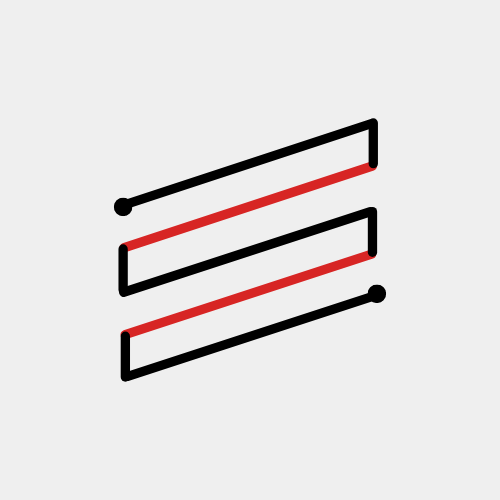
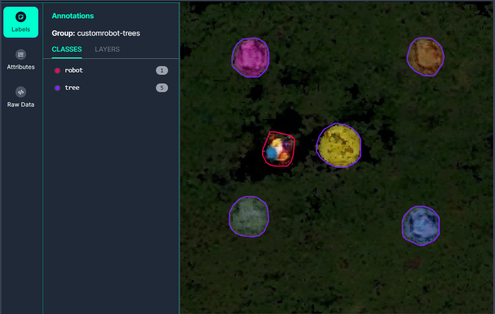

<a name="readme-top"></a>
<!-- PROJECT LOGO -->
<br />
<div align="center">
  <a href="https://github.com/GMR-AI/GMR-AI">
    
  </a>

<h3 align="center">GMR-AI</h3>

  <p align="center">
    Automated robot designed to take care of the grass on extensive surfaces. It has an APP that will allow the user to select the height at which they want the grass to be cut. In addition, it can measure the temperature and humidity of the environment, providing useful information about the climatic conditions. Equipped with multiple cameras that allow the robot to avoid obstacles and follow its own route efficiently.
    <br />
  </p>
</div>

<!-- TABLE OF CONTENTS -->
<details>
  <summary>Table of Contents</summary>
  <ol>
    <li>
      <a href="#about-the-project">About The Project</a>
      <ul>
        <li><a href="#built-with">Built With</a></li>
      </ul>
    </li>
    <li>
      <a href="#getting-started">Getting Started</a>
      <ul>
        <li><a href="#prerequisites">Prerequisites</a></li>
        <li><a href="#installation">Installation</a></li>
      </ul>
    </li>
    <li><a href="#usage">Usage</a></li>
    <li><a href="#project-details">Project Details</a></li>
    <li><a href="#project-task-list">Project Task List</a></li>
    <li><a href="#references">References</a></li>
    <li><a href="#license">License</a></li>
  </ol>
</details>


<!-- ABOUT THE PROJECT -->
## About The Project

This project involves the design of an automated robot capable of mowing the lawn on large-scale fields such as an aircraft carrier. The robot can be adjusted to cut the grass at various levels and is programmed to follow the most efficient mowing pattern possible.

In addition, it incorporates computer vision technology, which enables the robot to avoid obstacles. The robot is accompanied by multiple cameras that cover all the terrain from different types of views. These cameras survey the terrain and send all the information to the lawn-mowing robot for processing. This allows the robot to adjust its preplanned path as necessary.

The robot is also paired with a mobile application, which allows users to control the grass cutting level and turn the robot on and off. Furthermore, the application provides an accurate 3D representation of the entire terrain based on the images captured by these cameras. This comprehensive view gives users a clear understanding of the terrain and the ongoing mowing process.

<p align="right">(<a href="#readme-top">back to top</a>)</p>

### Built With

* [![ROS2][ROS2.com]][ROS2-url]
* [![Fritzing][Fritzing.org]][Fritzing-url]
* [![AndroidStudio][developer.android.com/studio]][AndroidStudio-url]
* [![Flutter][Flutter.dev]][Flutter-url]
* [![CoppeliaSim][CoppeliaRobotics.com]][CoppeliaSim-url]
* [![Python][Python.org]][Python-url]
* [![YOLO][v7labs.com]][YOLO-url]
* [![Flask][Flask.palletsprojects.com]][Flask-url]
* [![InstantNGP][github.com/NVlabs/instant-ngp]][InstantNGP-url]
* [![Google Cloud][cloud.google.com]][GoogleCloud-url]
* [![Firebase][firebase.google.com]][Firebase-url]


<p align="right">(<a href="#readme-top">back to top</a>)</p>


<!-- GETTING STARTED -->
## Getting Started

To set up your project, follow the instructions below.

### Prerequisites

The primary prerequisite to run this project is to have the latest version of Ubuntu 22.04. You can install it from the following link:
* [Ubuntu 22.04.4 LTS (Jammy Jellyfish)](https://releases.ubuntu.com/jammy/)

Once you have your operating system set up, install the simulator to see your GMR robot running. Make sure to install the EDU version and use it only for educational purposes:
* [CoppeliaSim EDU Edition - Latest version: V4.6.0 rev18](https://www.coppeliarobotics.com/)


For the 3D reconstruction process, it is necessary to install certain dependencies prior to cloning the `instant-ngp` project. The `README.md` file provided in the `instant-ngp` repository contains detailed instructions, particularly in the 'Requirements' section, which outlines the essential tools that need to be installed. 

* [NVLabs - Instant-NGP README.md](https://github.com/NVlabs/instant-ngp/blob/master/README.md)


### Installation

1. Clone the 3D reconstruction repository named Instant-NGP:
    ```sh
    git clone https://github.com/NVlabs/instant-ngp.git
    ```

2. Clone our repository:
    ```sh
    git clone https://github.com/GMR-AI/GMR-AI.git
    ```

3. Replace the `run.py` file from Instant-NGP with our custom `run.py` file:
    ```sh
    mv ~/GMR-AI/sim/run.py ~/instant-ngp/scripts/run.py
    ```

4. Install the CoppeliaSim dependencies:
    ```sh
    sudo apt install python3-pip
    python3 -m pip install pyzmq cbor2 empy==3.3.4 lark
    sudo apt install xsltproc
    ```

5. Install ROS2 Humble Version by following the instructions on the [ROS2 Humble Installation page](https://docs.ros.org/en/humble/Installation/Ubuntu-Install-Debians.html).

6. Install `colcon`:
    ```sh
    sudo apt install python3-colcon-common-extensions
    ```

7. Install `rosdep`:
    ```sh
    sudo apt-get install python3-rosdep
    sudo rosdep init
    rosdep update
    ```

8. Navigate to the `ros2_ws` folder and install dependencies:
    ```sh
    rosdep install --from-paths src --ignore-src -y --rosdistro humble
    ```

9. Prepare the packages (still in the `ros2_ws` folder):
    ```sh
    colcon build --symlink-install
    ```

10. Source the setup file in a new terminal window (still in the `ros2_ws` folder):
    ```sh
    . install/setup.bash
    ```

<p align="right">(<a href="#readme-top">back to top</a>)</p>

<!-- USAGE EXAMPLES -->
## Usage

To run your project, you will need to set up your phone device and install our APK available in our repository [MyGMR](https://github.com/GMR-AI/MyGMR). Once you create your account and add your GMR device to your list, run the following command in your computer:

```sh
ros2 launch gmrai_description main.launch.py coppelia_root_dir:=</absolute/path/to/coppelia/root/folder> coppelia_scene_path:=</absolute/path/to/coppelia/scene> coppelia_headless:=<True|False>
```
Now the GMR is connected. You can start a new job using your app, where it creates a 3D model of the terrain. You can then choose the height of the grass cut, and select the area that you want to cut. Start your job, where you will have a timer and a 3D model of the terrain you are cutting.

<p align="right">(<a href="#readme-top">back to top</a>)</p>

<!-- ROADMAP -->
## Project Details

In this section, we will delve into each aspect of the project. This includes detailed explanations about the hardware used, the circuitry of the said hardware, an overview of the mobile application, and finally, the computer vision sector. In the latter, we will discuss the deep learning models and 3D reconstruction techniques employed in the project.

### Hardware

The hardware used in this project are the following:
| Component                                          | Units | Price   |
|----------------------------------------------------|-------|---------|
| N20 6V Motor                                       | 4     | 4.5 €   |
| Mini servo FEETECH 3.5kg                           | 1     | 7.95 €  |
| POWERBANK 10000 MAh, Black                         | 1     | 14 €    |
| Virtavo Wireless HD 1080p Camera                   | 32    | 30.99 € |
| NVIDIA Jetson Nano                                 | 1     | 259 €   |
| DHT11 Humidity and Temperature Sensor Module       | 1     | 2.80 €  |
| 6 AA BATTERY HOLDER WITH CONNECTOR                 | 1     | 3.85 €  |
| L298N Dual H-Bridge Motor Controller               | 3     | 15.00 € |
| Square ON/OFF Switch                               | 1     | 1.25 €  |
| Pack of 6 AA Rechargeable Batteries 1.2V           | 1     | 11.43 € |
|                                                    |       |         |
| **Total Price:**                                   |       | 1354.96 €|

#### Fritzing
Using the hardware and the connections between each component from the table above, we’ve created the following circuitry through the Fritzing platform:


### MyGMR - Control your GMR device with our Android APP

We decided that the best form of controlling your GMR devices is by creating a friendly app that gives you the opportunity to give full control of your GMR devices and also offering a ton of information to decied whether or not cutt the grass in certain times. You can know how the APP works the source code by going to the [MyGMR](https://github.com/GMR-AI/MyGMR) repository. 


### Communication via ROS2 and Google Server 

EXPLICAR HERE!!!!

### YOLO V8 - Obstacle Detection
For obstacle detection, we created our own dataset with a training set, a validation set, and a test set. We started with a dataset of 63 images taken from a bird's-eye view of the entire simulation terrain. We then performed data augmentation, applying horizontal and vertical flips, 90-degree rotations clockwise and counter-clockwise, upside-down rotations, blurring up to 1.1 px, and adding noise to up to 0.3% of pixels. 

This process expanded our dataset to a total of 129 training images, 12 validation images, and 6 test images, for a grand total of 147 images. The objects in these images are relatively easy to identify due to their vibrant and striking colors, especially the trees.

We used Roboflow for object identification. Roboflow is an end-to-end computer vision platform that simplifies the process of building computer vision models. It streamlines the process between labeling your data and training your model, making it an ideal tool for our project.

We also utilized YOLOv8, the latest version of the YOLO (You Only Look Once) series of models, known for their considerable accuracy while maintaining a small model size. YOLOv8 is a state-of-the-art model that can be used for object detection, image classification, and instance segmentation tasks.

We decided to use 12 images for the validation set and 6 images for the test set. We chose to have more training images to increase our model's accuracy. We ran a test to determine the model's accuracy and found that it is 95.53%, meaning there is a 4.43% chance that the detection can fail.

Roboflow provides us with a YOLOv8 model that is fully trained and capable of detecting obstacles on the map. You can check our model [here](https://universe.roboflow.com/gmr/gmr-detection/dataset/2).



### 3D Reconstruction with Instant-NGP
In order to perform a 3D reconstruction of the terrain, we had to strategically place a total of 32 vision sensors across the area to ensure every detail was covered. The reason for using so many cameras is due to our utilization of a technology developed by NVLabs called Instant-NGP. This technology performs 3D reconstructions primarily using video inputs, where the camera moves around to capture every detail for optimal results. In our case, we didn’t have an aerial camera for this purpose, so we opted to use static images instead, specifically 32 images.

This process of reconstruction from images is resource-intensive, so we carry out the reconstruction on our PCs. However, if we had hardware like the Jetson Nano from NVIDIA, it would be capable of performing the 3D reconstruction independently.

The application of this technology is quite straightforward. As we mentioned in our installation segment, you simply need to clone their repository and then use our run.py program, replacing theirs.

It’s important to note that there’s a small chance (7.3%) that the 3D reconstruction might fail and not produce a precise result. If this happens, the entire process needs to be repeated.

Below is an image of the final reconstruction, which can be viewed through the MyGMR app.


<p align="right">(<a href="#readme-top">back to top</a>)</p>

<!-- CONTRIBUTING -->
## Project Task List

The task list for our project is divided into three distinct blocks, which are worked on in parallel. However, in some cases, collaboration between blocks is necessary. The tasks for each block are as follows:

### CoppeliaSim Simulation

1. **Designing the GMR Device:** Design the Grass Management Robot (GMR) and export it to CoppeliaSim, a robot simulation software.

2. **Applying Joints and Wheels:** Add joints and links to the model and generate an URDF for future use.

3. **Creating a Personalized World:** Create the world with some obstacles in which the robot operates and maneuver.

4. **Placing Cameras:** Place some cameras all over the area to ensure a good quality 3D reconstruction. (In the end, 32 cameras were needed to achieve that).

5. **Programming Robot Movements and ROS2 Integration:** Build all the robot logic and connect all its differents component together. To do this, use ROS2 (Robot Operating System 2) as it allows easy partitions between all the different functionalities and the required multitasking.

6. **Setting Up Server Communication:** Create a client in the robot that connects with the Google Cloud server to communicate with the MyGMR App.

### MyGMR - App 

1. **App Development:** Develop an application using Flutter (Dart) for the frontend and Flask (Python) for the backend. This combination allows for a robust and user-friendly interface while ensuring efficient server-side operations.

2. **Account Creation:** Implement a feature that allows users to create an account using their Google credentials via Firebase. This provides a secure and convenient way for users to access the app.

3. **Device Management:** Provide the ability for users to add and delete Ground Monitoring Robot (GMR) devices from their device list. This gives users full control over the devices they want to manage.

4. **Weather Information:** Display the current weather of the user's location. This can help users plan their GMR operations based on weather conditions.

5. **Job Creation:** Enable users to create a job for a specific GMR device. Users should be able to specify the height of the grass and the area they want to cut. This allows for customized operations based on user preferences.

6. **3D Terrain Model:** Show a 3D model of the terrain that is being cut. This model is generated by the robot using the Jetson Nano. This visual representation can help users understand the terrain better and plan their operations accordingly.

7. **Job Records:** Once a job is completed, users should be able to view a record of each job for each GMR device. This can help users track the performance and efficiency of their devices.

8. **Robot Information:** Provide information about the robot, including the model name, battery life, charging time, etc. This can help users manage their devices more effectively.

9. **Google Cloud Connection:** Connect the app to Google Cloud to facilitate communication between the app and the robot in the CoppeliaSim simulation. This ensures real-time data transfer and remote control of the robot.


### Computer Vision - YoloV8 & Instant-NGP

1. **3D Reconstruction Using Instant-NGP:** Use the 32 images captured by the cameras to perform a 3D reconstruction of the terrain using Instant-NGP, which generates a mesh (obj) and a pointcloud (ply).

2. **Pointcloud To Top-Down 2D Image:** Use the pointcloud to generate a 2D Top-Down image.

3. **Create Custom Dataset:** Generate a custom dataset using a set of previously generated images with the aforementioned method to detect obstacles and the robot on the field. This includes creating ground truth labels for both training and testing datasets using [RoboFlow](https://roboflow.com/).

4. **Train Object Detection Model:** Train a Yolov8 model for object segmentation using the previous dataset. After training, test the performance of the model to ensure it meets the required standards.

5. **Apply Object Detection:** Use the trained model for inference in each 2D generated image for slam. Use RViz, a 3D visualization tool for ROS and ROS2, to check that the robot's comprehension of its surroundings is as it should. This step is crucial to ensure the model can accurately detect objects in the simulated environment.

6. **Send 3D Reconstruction and 2D Image to Google Cloud and MyGMR App:** Send a 3D model and a 2D image to Google Cloud when asked from the MyGMR App.

<p align="right">(<a href="#readme-top">back to top</a>)</p>

## References

- [ROS2](https://docs.ros.org/en/humble/index.html): Documentation for the Robot Operating System 2 (ROS2).
- [Roboflow Dataset](https://app.roboflow.com/gmr/gmr-detection/2): The specific dataset used for training the object detection model in our project.
- [Instant-NGP](https://github.com/NVlabs/instant-ngp): The GitHub repository for NVLabs' Instant-NGP technology used for 3D reconstruction.
- [Flutter Libraries](https://pub.dev/): A collection of libraries for Flutter, the UI toolkit used for frontend development in our app.
- [YoloV8](https://github.com/ultralytics/ultralytics): The GitHub repository for the YoloV8 model used for object detection.
- [Flask](https://flask.palletsprojects.com/en/3.0.x/): Documentation for Flask, the micro web framework used for backend development in our app.
- [Firebase](https://firebase.google.com/docs/build?hl=es): Documentation for Firebase, the platform used for user authentication in our app.
- [CloudSQL](https://cloud.google.com/sql/docs/mysql/samples?hl=es-419): Samples and documentation for CloudSQL, the service used for database management in our app.
- [Coverage Planning](https://github.com/AtsushiSakai/PythonRobotics): The GitHub repository for PythonRobotics, which includes algorithms for coverage planning.
<p align="right">(<a href="#readme-top">back to top</a>)</p>

<!-- LICENSE -->
## License

Distributed under the MIT License. See `LICENSE.txt` for more information.

<p align="right">(<a href="#readme-top">back to top</a>)</p>


<!-- MARKDOWN LINKS & assets -->
[contributors-shield]: https://img.shields.io/github/contributors/github_username/repo_name.svg?style=for-the-badge
[contributors-url]: https://github.com/github_username/repo_name/graphs/contributors
[forks-shield]: https://img.shields.io/github/forks/github_username/repo_name.svg?style=for-the-badge
[forks-url]: https://github.com/github_username/repo_name/network/members
[stars-shield]: https://img.shields.io/github/stars/github_username/repo_name.svg?style=for-the-badge
[stars-url]: https://github.com/github_username/repo_name/stargazers
[issues-shield]: https://img.shields.io/github/issues/github_username/repo_name.svg?style=for-the-badge
[issues-url]: https://github.com/github_username/repo_name/issues
[license-shield]: https://img.shields.io/github/license/github_username/repo_name.svg?style=for-the-badge
[license-url]: https://github.com/github_username/repo_name/blob/master/LICENSE.txt


[ROS2.com]: https://img.shields.io/badge/ROS2-22314E?style=for-the-badge&logo=ros&logoColor=white
[ROS2-url]: https://www.ros.org/
[Fritzing.org]: https://img.shields.io/badge/Fritzing-FBE000?style=for-the-badge&logo=fritzing&logoColor=black
[Fritzing-url]: https://fritzing.org/home/
[developer.android.com/studio]: https://img.shields.io/badge/Android_Studio-3DDC84?style=for-the-badge&logo=android-studio&logoColor=white
[AndroidStudio-url]: https://developer.android.com/studio
[Flutter.dev]: https://img.shields.io/badge/Flutter-02569B?style=for-the-badge&logo=flutter&logoColor=white
[Flutter-url]: https://flutter.dev/
[CoppeliaRobotics.com]: https://img.shields.io/badge/CoppeliaSim-00979D?style=for-the-badge&logo=coppeliasim&logoColor=white
[CoppeliaSim-url]: https://www.coppeliarobotics.com/
[Python.org]: https://img.shields.io/badge/Python-3776AB?style=for-the-badge&logo=python&logoColor=white
[Python-url]: https://www.python.org/
[v7labs.com]: https://img.shields.io/badge/YOLO-000000?style=for-the-badge&logo=yolo&logoColor=white
[YOLO-url]: https://www.v7labs.com/blog/yolo-object-detection
[Flask.palletsprojects.com]: https://img.shields.io/badge/Flask-000000?style=for-the-badge&logo=flask&logoColor=white
[Flask-url]: https://flask.palletsprojects.com/
[github.com/NVlabs/instant-ngp]: https://img.shields.io/badge/InstantNGP-000000?style=for-the-badge&logo=github&logoColor=white
[InstantNGP-url]: https://github.com/NVlabs/instant-ngp
[cloud.google.com]: https://img.shields.io/badge/Google_Cloud-4285F4?style=for-the-badge&logo=google-cloud&logoColor=white
[GoogleCloud-url]: https://cloud.google.com/
[firebase.google.com]: https://img.shields.io/badge/Firebase-FFCA28?style=for-the-badge&logo=firebase&logoColor=black
[Firebase-url]: https://firebase.google.com/
