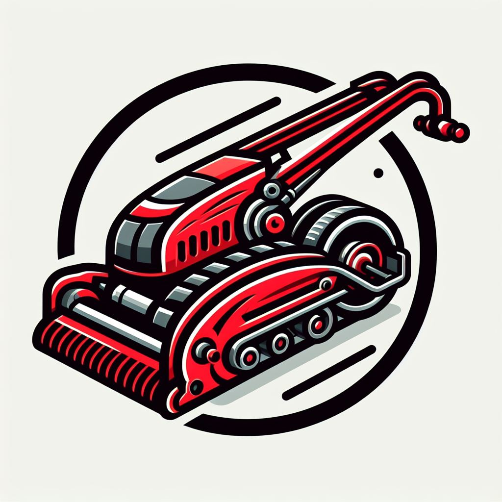
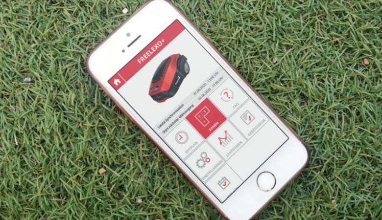

<a name="readme-top"></a>
<!-- PROJECT LOGO -->
<br />
<div align="center">
  <a href="https://github.com/YssfDevOps/GMR-AI">
    
  </a>

<h3 align="center">GMR-AI</h3>

  <p align="center">
    Automated robot designed to take care of the grass on extensive surfaces. It will have an APP that will allow the user to select the height at which they want the grass to be cut. In addition, it can measure the temperature and humidity of the environment, providing useful information about the climatic conditions. Equipped with a camera and sensors that allow the robot to avoid obstacles and follow its own route efficiently.
    <br />
  </p>
</div>

<!-- TABLE OF CONTENTS -->
<details>
  <summary>Table of Contents</summary>
  <ol>
    <li>
      <a href="#about-the-project">About The Project</a>
      <ul>
        <li><a href="#built-with">Built With</a></li>
      </ul>
    </li>
    <li>
      <a href="#getting-started">Getting Started</a>
      <ul>
        <li><a href="#prerequisites">Prerequisites</a></li>
        <li><a href="#installation">Installation</a></li>
      </ul>
    </li>
    <li><a href="#usage">Usage</a></li>
    <li><a href="#roadmap">Roadmap</a></li>
    <li><a href="#contributing">Contributing</a></li>
    <li><a href="#license">License</a></li>
    <li><a href="#contact">Contact</a></li>
    <li><a href="#acknowledgments">Acknowledgments</a></li>
  </ol>
</details>


<!-- ABOUT THE PROJECT -->
## About The Project

[![Product Name Screen Shot][product-screenshot]](https://example.com)

This project involves the design of an automated robot capable of mowing the lawn on an aircraft carrier or other large-scale fields. The robot can be adjusted to cut the grass at various levels and follows the most efficient mowing pattern possible.

In addition, it incorporates computer vision technology, which allows the robot to avoid obstacles and determine whether it is cutting grass or not. The robot is accompanied by aerial cameras, in this case, drones, which survey the terrain and send all the information to the lawn-mowing robot for processing. This allows the robot to adjust its preplanned path as necessary.

The robot is also paired with a mobile application, which allows users to control the grass cutting level and turn the robot on and off. Furthermore, the application provides the ability to view drone footage and a real-time, accurate 3D representation of the entire terrain based on images captured by the drone.

<p align="right">(<a href="#readme-top">back to top</a>)</p>


### Built With

* [![ROS2][ROS2.com]][ROS2-url]
* [![Fritzing][Fritzing.org]][Fritzing-url]
* [![AndroidStudio][developer.android.com/studio]][AndroidStudio-url]
* [![Flutter][Flutter.dev]][Flutter-url]
* [![CoppeliaSim][CoppeliaRobotics.com]][CoppeliaSim-url]
* [![Python][Python.org]][Python-url]
* [![YOLO][v7labs.com]][YOLO-url]
* [![TensorFlow Keras][Keras.io]][TensorFlowKeras-url]
* [![Kotlin][Kotlinlang.org]][Kotlin-url]


<p align="right">(<a href="#readme-top">back to top</a>)</p>


<!-- GETTING STARTED -->
## Getting Started

This is an example of how you may give instructions on setting up your project locally.
To get a local copy up and running follow these simple example steps.

### Prerequisites

This is an example of how to list things you need to use the software and how to install them.
* npm
  ```sh
  npm install npm@latest -g
  ```

### Installation

1. Get a free API Key at [https://example.com](https://example.com)
2. Clone the repo
   ```sh
   git clone https://github.com/github_username/repo_name.git
   ```
3. Install NPM packages
   ```sh
   npm install
   ```
4. Enter your API in `config.js`
   ```js
   const API_KEY = 'ENTER YOUR API';
   ```

<p align="right">(<a href="#readme-top">back to top</a>)</p>


<!-- USAGE EXAMPLES -->
## Usage
Use this space to show useful examples of how a project can be used. Additional screenshots, code examples and demos work well in this space. You may also link to more resources.

_For more examples, please refer to the [Documentation](https://example.com)_

<p align="right">(<a href="#readme-top">back to top</a>)</p>


<!-- ROADMAP -->
## Library

In this section, we will delve into each aspect of the project. This includes detailed explanations about the hardware used, the circuitry of the said hardware, an overview of the mobile application, and finally, the computer vision sector. In the latter, we will discuss the deep learning models and 3D reconstruction techniques employed in the project.

### Hardware

The hardware used in this project are the following:
- Jetson Nano Developer Kit (NVIDIA)
- Arduino UNO
- Servomotor (x1)
- DC Motor (x4)
- DUAL H-BRIDGE MOTOR DRIVER (x3)
- Sensor de humedad
- Sensor de temperatura
- Bateria de acido
- Cameras (or drons) (x4)
- LEDs (x4)

#### Fritzing


### Software - App Control


### Computer Vision


<p align="right">(<a href="#readme-top">back to top</a>)</p>

<!-- CONTRIBUTING -->
## Project Task List

The task list for our project is divided into four distinct blocks, which are worked on in parallel. However, in some cases, collaboration between blocks will be necessary. The tasks for each block are as follows:

### CoppeliaSim Simulation

1. Design the Robot Structure: Create the physical design of the robot.
2. Connect the Application to the Simulator: Establish a connection between the mobile application and the simulator.
3. Implement the Machine Learning Model: Integrate the machine learning model into the simulator.
4. Design the Robot’s Environment: Create the environment in which the robot will operate.
5. Establish Component Connections: Connect the various components of the robot and the simulator.

### GMR-AI App 

1. Implement 3D Model Viewer: Develop a feature to view 3D models within the application.
2. Establish Connection to Jetson Nano: Implement a feature to exchange information between the mobile device and the Jetson Nano.
3. Implement Image-based Terrain Selector: Develop a feature to select terrain based on an image.
4. Integrate Google Maps API: Incorporate the Google Maps API into the application.
5. Implement Video Player for Aerial View: Develop a feature to view aerial footage of the robot’s operation.
6. Implement Real-time Terrain Coverage Visual: Develop a feature to visualize the terrain covered by the robot in real-time.
7. Integrate Weather API: Incorporate a weather API to provide weather updates.

### Machine Learning - Vision Computing

1. Find Dataset for Model Training: Locate a suitable dataset for training the model.
2. Create Custom Dataset: Generate a custom dataset from images taken in Coppelia, including creating ground truth labels for both training and testing.
3. Train Object Detection Model: Train a specific model for object detection using the dataset found online and test its performance.
4. Apply Object Detection Model to Coppelia: Implement the object detection model in Coppelia.
5. Find Dataset for 3D Stereo Reconstruction: Locate a suitable dataset for 3D stereo reconstruction.
6. Train 3D Model Using Stereo Images: Train a 3D model using stereo images to verify its functionality.
7. Use Coppelia Camera Dataset for 3D Reconstruction: Use the dataset obtained from Coppelia’s cameras to perform 3D reconstruction with the created model.
8. Send 3D Reconstruction to Mobile Application: Implement a feature to send the 3D reconstruction to the mobile application.
9. Implement Vision Models on Jetson Nano: Deploy both vision models on the Jetson Nano.

<p align="right">(<a href="#readme-top">back to top</a>)</p>

## References

<!-- LICENSE -->
## License

Distributed under the MIT License. See `LICENSE.txt` for more information.

<p align="right">(<a href="#readme-top">back to top</a>)</p>


<!-- MARKDOWN LINKS & IMAGES -->
[contributors-shield]: https://img.shields.io/github/contributors/github_username/repo_name.svg?style=for-the-badge
[contributors-url]: https://github.com/github_username/repo_name/graphs/contributors
[forks-shield]: https://img.shields.io/github/forks/github_username/repo_name.svg?style=for-the-badge
[forks-url]: https://github.com/github_username/repo_name/network/members
[stars-shield]: https://img.shields.io/github/stars/github_username/repo_name.svg?style=for-the-badge
[stars-url]: https://github.com/github_username/repo_name/stargazers
[issues-shield]: https://img.shields.io/github/issues/github_username/repo_name.svg?style=for-the-badge
[issues-url]: https://github.com/github_username/repo_name/issues
[license-shield]: https://img.shields.io/github/license/github_username/repo_name.svg?style=for-the-badge
[license-url]: https://github.com/github_username/repo_name/blob/master/LICENSE.txt


[ROS2.com]: https://img.shields.io/badge/ROS2-22314E?style=for-the-badge&logo=ros&logoColor=white
[ROS2-url]: https://www.ros.org/
[Fritzing.org]: https://img.shields.io/badge/Fritzing-FBE000?style=for-the-badge&logo=fritzing&logoColor=black
[Fritzing-url]: https://fritzing.org/home/
[developer.android.com/studio]: https://img.shields.io/badge/Android_Studio-3DDC84?style=for-the-badge&logo=android-studio&logoColor=white
[AndroidStudio-url]: https://developer.android.com/studio
[Flutter.dev]: https://img.shields.io/badge/Flutter-02569B?style=for-the-badge&logo=flutter&logoColor=white
[Flutter-url]: https://flutter.dev/
[CoppeliaRobotics.com]: https://img.shields.io/badge/CoppeliaSim-00979D?style=for-the-badge&logo=coppeliasim&logoColor=white
[CoppeliaSim-url]: https://www.coppeliarobotics.com/
[Python.org]: https://img.shields.io/badge/Python-3776AB?style=for-the-badge&logo=python&logoColor=white
[Python-url]: https://www.python.org/
[v7labs.com]: https://img.shields.io/badge/YOLO-000000?style=for-the-badge&logo=yolo&logoColor=white
[YOLO-url]: https://www.v7labs.com/blog/yolo-object-detection
[Keras.io]: https://img.shields.io/badge/TensorFlow_Keras-D00000?style=for-the-badge&logo=tensorflow&logoColor=white
[TensorFlowKeras-url]: https://keras.io/
[Kotlinlang.org]: https://img.shields.io/badge/Kotlin-0095D5?style=for-the-badge&logo=kotlin&logoColor=white
[Kotlin-url]: https://kotlinlang.org/
